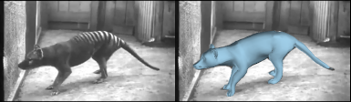
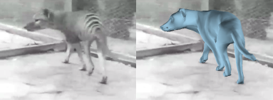
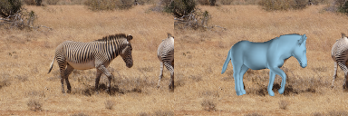
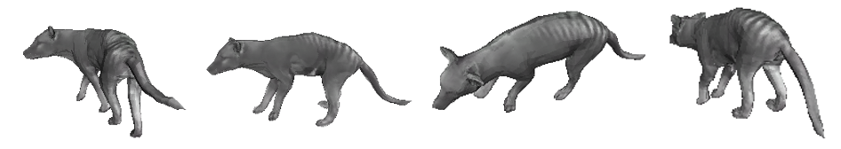
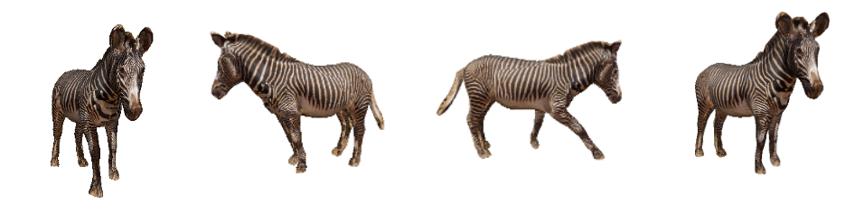
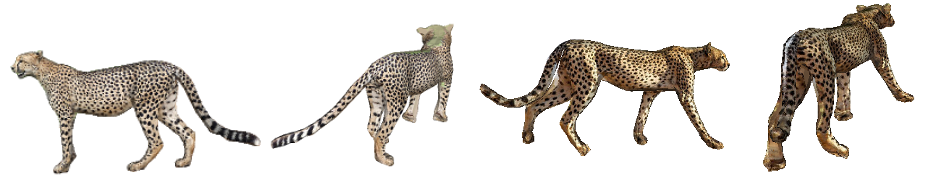

# smalr_online

This code fits the [SMAL](http://smal.is.tue.mpg.de/) model to a set of images with 2D keypoints and silhouettes annotation, and then perfromes a refinement as described in the paper "Lions and Tigers and Bears: Capturing Non-Rigid, 3D, Articulated Shape from Images".

The code requires python 3.8. 

We provide a demo for applying the code to images of the Tasmanian tiger, the Grevy's zebra, and cheetah.

The code was written by Silvia Zuffi and Angjoo Kanazawa, with contributions from Matt Loper, Federica Bogo, Javier Romero, Gerard Pons Moll.

## Installation
The code requires the following packages:
chumpy,
opencv,
matplotlib,
numpy, 
opendr, 
mesh library (https://github.com/MPI-IS/mesh),
SMPL (https://smpl.is.tue.mpg.de/),
Eigen (http://eigen.tuxfamily.org/index.php?title=Main_Page#Download)

You can follow this procedure:
```
python3 -m venv venv_smalr_online
source venv_smalr_online/bin/activate
pip3 install chumpy
pip3 install opencv-python
pip3 install matplotlib
pip3 install opendr
pip3 install sklearn
```
You need to do the following changes to opendr:
In venv_smalr_online/lib/python3.8/site-packages/opendr/common.py
change line 467 adding cast to int as (int(verts_by_face.shape[0]/f.shape[1]).
In venv_smalr_online/lib/python3.8/site-packages/opendr/renderer.py
search for dImage_wrt_2dVerts and add a cast to int as int(self.v.r.size/3).
In venv_smalr_online/lib/python3.8/site-packages/opendr/camera.py
at line 102 add the cast to int as int(self.v.r.size*2/3).

Install the mesh library following the instructions in https://github.com/MPI-IS/mesh.

Download Eigen, you do not need to compile it.

You need to compile the code in the directory src/smalr/sbody/alignment/mesh_distance. 
To do this go to the directory:
```
cd src/smalr/sbody/alignment/mesh_distance
```
Edit the file setup.py to set EIGEN_DIR to the location of Eigen. Then type:
```
make
```

Place the directory `smpl_webuser` from SMPL in the `src/smalr` directory. Note that to use python3 you need to load the pickle file with: 
```
dd = pickle.load(open(fname_or_dict, "rb"), encoding='latin1')
```
Settings are listed in `smalr_settings.py`.

## Running the Demo
Run
`python run_on_animals.py`. 

You will obtain images like the one below:

 
 
 
 


In the settings file, there is an option `max_tex_weight` that if set to True gives sharp texture, and if set to False gives smooth texture.
We used smooth texture for the Tasmanian tiger in the [SMALR](http://smalr.is.tue.mpg.de/) paper and shape texture for making the dataset of Grevy's zebra in the [SMALST](https://github.com/silviazuffi/smalst) paper. 



We also provide a couple of examples with cheetahs, using only one image.


If you use the code please cite the following papers:

```
@inproceedings{Zuffi:CVPR:2018,  
  title = {Lions and Tigers and Bears: Capturing Non-Rigid, {3D}, Articulated Shape from Images},  
  author = {Zuffi, Silvia and Kanazawa, Angjoo and Black, Michael J.},  
  booktitle = {IEEE Conference on Computer Vision and Pattern Recognition (CVPR)},  
  pages = {3955--3963},  
  publisher = {IEEE Computer Society},  
  year = {2018}. 
}

@inproceedings{Zuffi:CVPR:2017,  
  title = {{3D} Menagerie: Modeling the {3D} Shape and Pose of Animals},  
  author = {Zuffi, Silvia and Kanazawa, Angjoo and Jacobs, David and Black, Michael J.},  
  booktitle = {IEEE Conference on Computer Vision and Pattern Recognition (CVPR)},  
  pages = {5524--5532},  
  publisher = {IEEE Computer Society},  
  year = {2017},  
}
```
